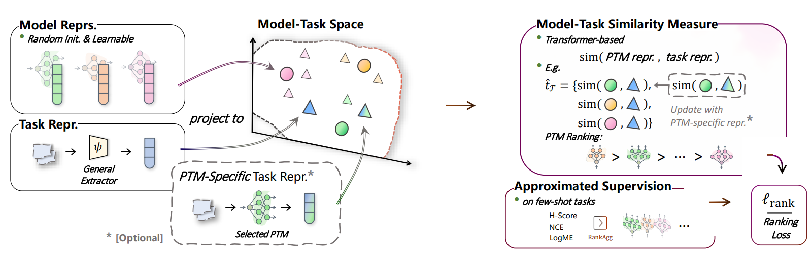

<div align="center">
  <a href="http://zhijian.readthedocs.io"></a>
</div>


&nbsp;

<div align="center">
    .svg?style=for-the-badge" alt="Generic badge", height="21">
    
    <br>
    
    
    <br>
    
    
</div>
<h3 align="center">
    <p>
        Model Spider: Learning to Rank Pre-Trained Models Efficiently (NeurIPS 2023 Spotlight)
    <p>
</h3>
<h4 align="center">
    <p>
        📑 <a href="https://arxiv.org/abs/2306.03900">[Paper]</a> [<b>Code</b>]</a>
    <p>
<!--     <p>
        <b>English</b> |
        <a href="https://github.com/zhangyikaii/Model-Spider/edit/main/README_CN.md">中文</a>
    <p> -->
</h4>

<details>
    <summary>Detailed Introduction</summary>
    <p>
    Figuring out which Pre-Trained Model (PTM) from a model zoo fits the target task is essential to take advantage of plentiful model resources. With the availability of <b>numerous heterogeneous PTMs from diverse fields</b>, efficiently selecting <b>the most suitable</b> PTM is challenging due to the time-consuming costs of carrying out forward or backward passes over all PTMs. In this paper, we propose <b>Model Spider</b>, which tokenizes both PTMs and tasks by <b>summarizing their characteristics into vectors to enable efficient PTM selection</b>.
    <br>
    By leveraging the <b>approximated performance of PTMs</b> on a separate set of training tasks, <b>Model Spider</b> learns to construct representation and measure the fitness score between <b>a model-task pair</b> via their representation. The ability to rank relevant PTMs higher than others generalizes to new tasks. With the top-ranked PTM candidates, we further learn to enrich task repr. with their PTM-specific semantics <b>to re-rank the PTMs for better selection</b>. <b>Model Spider</b> balances efficiency and selection ability, making PTM selection like a spider preying on a web.
    <br>
    <b>Model Spider</b> demonstrates promising performance across various model categories, including <b>visual models and Large Language Models (LLMs)</b>. In this repository, we have built a comprehensive and user-friendly PyTorch-based model ranking toolbox for evaluating the future generalization performance of models. It aids in selecting <b>the most suitable</b> foundation pre-trained models for achieving optimal performance in real-world tasks <b>after fine-tuning</b>. In this benchmark for selecting/ranking PTMs, we have reproduced relevant model selection methods such as H-Score, LEEP, LogME, NCE, NLEEP, OTCE, PACTran, GBC, and LFC.
    <ol>
        <li>We introduce a <em>single-source model zoo</em>, building <b>10 PTMs</b> on ImageNet across five architecture families, <em>i.e.</em>, Inception, ResNet, DenseNet, MobileNet, and MNASNet. These models can be evaluated on <b>9 downstream datasets</b> using measure like <em>weighted tau</em>, including Aircraft, Caltech101, Cars, CIFAR10, CIFAR100, DTD, Pet, and SUN397 for classification, UTKFace and dSprites for regression.</li>
        <li>We construct a <em>multi-source model zoo</em> where <b>42 heterogeneous PTMs</b> are pre-trained from multiple datasets, with 3 architectures of similar magnitude, <em>i.e.</em>, Inception-V3, ResNet-50, and DenseNet-201, pre-trained on 14 datasets, including animals, general and 3D objects, plants, scene-based, remote sensing, and multi-domain recognition. We evaluate the ability to select PTMs on Aircraft, DTD, and Pet datasets.</li>
    </ol>
    </p>
</details>

In this repo, you can figure out:

* Implementations of **Pre-trained Model Selection / Ranking *(for unseen data)*** with an accompanying benchmark evaluation, including **H-Score, LEEP, LogME, NCE, NLEEP, OTCE, PACTran, GBC, and LFC**.
* **Get started quickly** with our method **Model Spider**, and enjoy its user-friendly inference capabilities.
* Feel free to **customize** the application scenarios of **Model Spider**!
<!--
* **A pre-trained model zoo** containing **42** heterogeneous models (**3** architectures, Inception-V3, ResNet-50, and DenseNet-201 (ImageNet pretrained), fine-tuned on **14** downstream vision datasets).
-->

&nbsp;

## Table of Contents
- [Table of Contents](#table-of-contents)
- [Pre-trained Model Ranking Performance](#pre-trained-model-ranking-performance)
- [Code Implementation](#code-implementation)
  - [Quick Start \& Reproduce](#quick-start--reproduce)
- [Reproduce for Other Baseline Methods](#reproduce-for-other-baseline-methods)
- [Contributing](#contributing)
- [Citing Model Spider](#citing-model-spider)

&nbsp;

## Pre-trained Model Ranking Performance

Performance comparisons of **9 baseline approaches** and Model Spider on the *single-source model zoo* with weighted Kendall's tau. We denote the best-performing results in **bold**.

<table>
    <tr>
        <td><b>Method</b></td>
        <td colspan="10" align="center"><b>Downstream Target Dataset</b></td>
    </tr>
    <tr>
        <td><b>Weighted Tau</b></td>
        <td align="center">Aircraft</td>
        <td align="center">Caltech101</td>
        <td align="center">Cars</td>
        <td align="center">CIFAR10</td>
        <td align="center">CIFAR100</td>
        <td align="center">DTD</td>
        <td align="center">Pets</td>
        <td align="center">SUN397</td>
        <td align="center">Mean</td>
    </tr>
    <tr>
        <td>H-Score </td>
        <td align="center">0.328</td>
        <td align="center">0.738</td>
        <td align="center">0.616</td>
        <td align="center">0.797</td>
        <td align="center">0.784</td>
        <td align="center">0.395</td>
        <td align="center">0.610</td>
        <td align="center">0.918</td>
        <td align="center">0.648</td>
    </tr>
    <tr>
        <td>NCE</td>
        <td align="center">0.501</td>
        <td align="center">0.752</td>
        <td align="center">0.771</td>
        <td align="center">0.694</td>
        <td align="center">0.617</td>
        <td align="center">0.403</td>
        <td align="center">0.696</td>
        <td align="center">0.892</td>
        <td align="center">0.666</td>
    </tr>
    <tr>
        <td>LEEP</td>
        <td align="center">0.244</td>
        <td align="center">0.014</td>
        <td align="center">0.704</td>
        <td align="center">0.601</td>
        <td align="center">0.620</td>
        <td align="center">-0.111</td>
        <td align="center">0.680</td>
        <td align="center">0.509</td>
        <td align="center">0.408</td>
    </tr>
    <tr>
        <td><span style="font-family:sans-serif;">N-</span>LEEP</td>
        <td align="center">-0.725</td>
        <td align="center">0.599</td>
        <td align="center">0.622</td>
        <td align="center">0.768</td>
        <td align="center">0.776</td>
        <td align="center">0.074</td>
        <td align="center">0.787</td>
        <td align="center">0.730</td>
        <td align="center">0.454</td>
    </tr>
    <tr>
        <td>LogME</td>
        <td align="center"><b>0.540</b></td>
        <td align="center">0.666</td>
        <td align="center">0.677</td>
        <td align="center">0.802</td>
        <td align="center">0.798</td>
        <td align="center">0.429</td>
        <td align="center">0.628</td>
        <td align="center">0.870</td>
        <td align="center">0.676</td>
    </tr>
    <tr>
        <td>PACTran</td>
        <td align="center">0.031</td>
        <td align="center">0.200</td>
        <td align="center">0.665</td>
        <td align="center">0.717</td>
        <td align="center">0.620</td>
        <td align="center">-0.236</td>
        <td align="center">0.616</td>
        <td align="center">0.565</td>
        <td align="center">0.397</td>
    </tr>
        <tr>
        <td>OTCE</td>
        <td align="center">-0.241</td>
        <td align="center">-0.011</td>
        <td align="center">-0.157</td>
        <td align="center">0.569</td>
        <td align="center">0.573</td>
        <td align="center">-0.165</td>
        <td align="center">0.402</td>
        <td align="center">0.218</td>
        <td align="center">0.149</td>
    </tr>
    <tr>
        <td>LFC</td>
        <td align="center">0.279</td>
        <td align="center">-0.165</td>
        <td align="center">0.243</td>
        <td align="center">0.346</td>
        <td align="center">0.418</td>
        <td align="center">-0.722</td>
        <td align="center">0.215</td>
        <td align="center">-0.344</td>
        <td align="center">0.034</td>
    </tr>
    <tr>
        <td>GBC</td>
        <td align="center">-0.744</td>
        <td align="center">-0.055</td>
        <td align="center">-0.265</td>
        <td align="center">0.758</td>
        <td align="center">0.544</td>
        <td align="center">-0.102</td>
        <td align="center">0.163</td>
        <td align="center">0.457</td>
        <td align="center">0.095</td>
    </tr>
    <tr>
        <td><b>Moder Spider</b> (Ours)</td>
        <td align="center">0.506</td>
        <td align="center"><b>0.761</b></td>
        <td align="center"><b>0.785</b></td>
        <td align="center"><b>0.909</b></td>
        <td align="center"><b>1.000</b></td>
        <td align="center"><b>0.695</b></td>
        <td align="center"><b>0.788</b></td>
        <td align="center"><b>0.954</b></td>
        <td align="center"><b>0.800</b></td>
    </tr>
    <line>
</table>

&nbsp;

## Code Implementation

### Quick Start & Reproduce

- Set up the environment:
    ```bash
    conda create --name opencompass python=3.10 pytorch torchvision pytorch-cuda -c nvidia -c pytorch -y
    conda activate modelspider
    git clone https://github.com/zhangyikaii/Model-Spider.git
    cd Model-Spider
    pip install -r requirements.txt
    ```

- Choose your path `xxx/xx` to store data & model:
    ```bash
    source ./scripts/modify-path.sh xxx/xx
    ```

- Download the data and pre-trained **model spider** [here](https://drive.google.com/drive/folders/1EoUBOfqWdV5qG_GO897pneJtmxouP5vL?usp=sharing) to previous path `xxx/xx`. (Note that the training set for model spider is sampled from EuroSAT, OfficeHome, PACS, SmallNORB, STL10 and VLCS)
- Unzip **c_data.zip** to path `xxx/xx/data/` and then run:
    ```shell
    bash scripts/test-model-spider.sh xxx/xx/best.pth
    ```
    The results will be displayed on the screen.

&nbsp;

## Reproduce for Other Baseline Methods

We provided results of baseline method in the `assests/baseline_results.csv` file. Run following command to reproduce them:

```shell
bash scripts/reproduce-baseline-methods.sh
```
&nbsp;

## Contributing

Model Spider is currently in active development, and we warmly welcome any contributions aimed at enhancing capabilities. Whether you have insights to share regarding pre-trained models, data, or innovative ranking methods, we eagerly invite you to join us in making Model Spider even better.

&nbsp;

## Citing Model Spider

```latex
@inproceedings{ModelSpiderNeurIPS23,
  author    = {Yi{-}Kai Zhang and
               Ting{-}Ji Huang and
               Yao{-}Xiang Ding and
               De{-}Chuan Zhan and
               Han{-}Jia Ye},
  title     = {Model Spider: Learning to Rank Pre-Trained Models Efficiently},
  booktitle = {Advances in Neural Information Processing Systems 36: Annual Conference
               on Neural Information Processing Systems 2023, NeurIPS 2023, New Orleans,
               LA, USA, December 10 - 16, 2023},
  year      = {2023},
}
```
